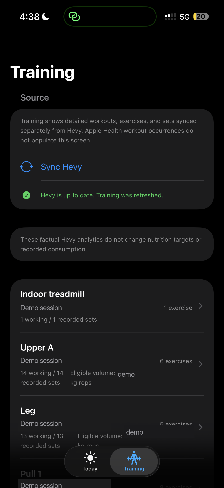

# Nytr

**An evidence-driven iOS nutrition and training companion that turns real health, food, and workout data into deterministic daily guidance.**

Nytr combines Apple Health body measurements, Hevy training history, dining and
food nutrition data, barcode food entry, weight-trend analysis, and deterministic
coaching to answer practical questions such as what to eat next, whether
nutrition targets need adjustment, and how training performance is progressing.

Unlike a generic AI fitness app, Nytr keeps factual data and calculations
authoritative. AI is optional and downstream: it can explain evidence, but it
cannot invent meals, modify health records, change targets, or override
deterministic decisions.

## The problem

Nutrition apps often blur estimates, recommendations, and facts. Nytr keeps them
separate: external evidence is captured with provenance, deterministic Python
performs the arithmetic and trend analysis, and the owner explicitly approves
targets or records consumption.

## Key features

- SwiftUI iOS client with native HealthKit integration.
- Python/FastAPI backend backed by PostgreSQL/Supabase.
- Hevy training integration with source-authoritative workout detail.
- Barcode food entry through Open Food Facts with explicit provenance.
- Automated dining-data ingestion using provider-bounded, fail-closed parsing.
- Deterministic calorie/protein target review and weight/progress tracking.
- Deterministic progressive-overload coaching for supported training evidence.
- Optional evidence-grounded AI review that explains, but never authors, facts.
- Fail-closed evidence model with explicit user approval for target-changing
  recommendations.

## Architecture and authority model

```text
HealthKit / Hevy / dining / owner facts
              -> authenticated adapters
              -> PostgreSQL + row-level security
              -> deterministic Python domain
              -> SwiftUI companion
              -> optional non-authoritative AI prose
```

HealthKit is authoritative for factual body weight and workout observations.
Hevy is authoritative for imported exercise/set detail. Dining providers are
authoritative only for published menu/nutrition evidence. Owner-entered profile,
waist evidence, targets, goal direction, and consumption decisions remain
explicit and separate. AI cannot calculate, correct, or write authoritative
facts.

## Tech stack

Python 3.11+, FastAPI, PostgreSQL/Supabase, psycopg, Pydantic, pytest, Ruff,
strict mypy, SwiftUI, Swift Charts, HealthKit, and a provider-neutral AI port.

## Safety model

All numeric nutrition, target, trend, eligibility, and coaching decisions are
deterministic and testable. Missing or partial evidence fails closed. Starting
calories are clearly labeled estimates until the owner approves an immutable
target. Waist is supplementary progress evidence: it never infers body fat,
changes calories, or switches a gain/maintain/lose phase automatically.

## Screenshots

<table>
<tr>
<td align="center"><strong>Today</strong></td>
<td align="center"><strong>Progress</strong></td>
<td align="center"><strong>Training</strong></td>
</tr>
<tr>
<td></td>
<td></td>
<td></td>
</tr>
</table>

Real Nytr iOS interface shown with privacy-sanitized values.

## Local setup

```bash
cp .env.example .env
cd backend
python -m venv .venv
.venv/bin/pip install -e '.[dev]'
.venv/bin/pytest
```

For the iOS target, open the project generated from
`ios/NutritionHealthCompanion/Project/project.yml` and provide local placeholder
configuration from `ios/NutritionHealthCompanion/Project/Config.xcconfig`.
Never commit local credentials.

## Synthetic data and privacy

The public mirror contains fabricated menu/label fixtures and no real health,
body, routine, class, gym, meal, device, or production records. It does not
bundle institutional dining pages or credentials. Any real integration must be
configured privately and must satisfy the provider's terms and data-use rules.
Open Food Facts data remains community data; attribution obligations are listed
in [THIRD_PARTY_NOTICES.md](THIRD_PARTY_NOTICES.md).

## Project status

Nytr is production-released and engineering-complete. Feature development is
frozen; physical-device demo validation, demo capture, and résumé/portfolio
presentation remain deferred. This sanitized mirror intentionally excludes
production data and deployment configuration.

See [the public architecture notes](docs/ARCHITECTURE.md),
[security guidance](SECURITY.md), and [the roadmap](docs/ROADMAP.md).
