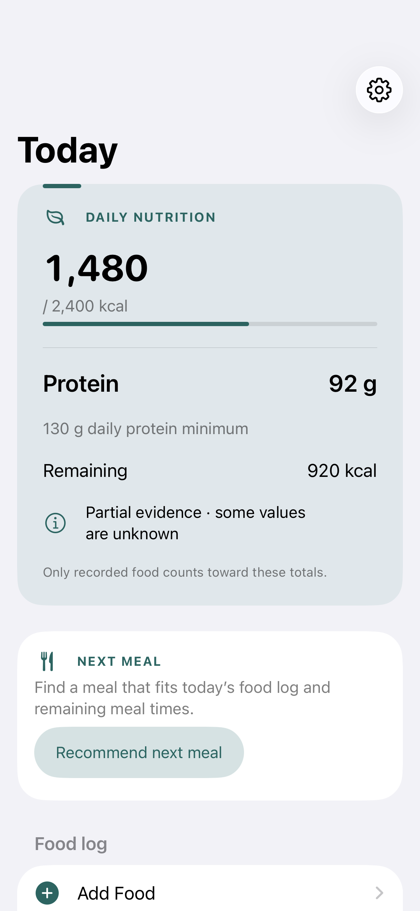
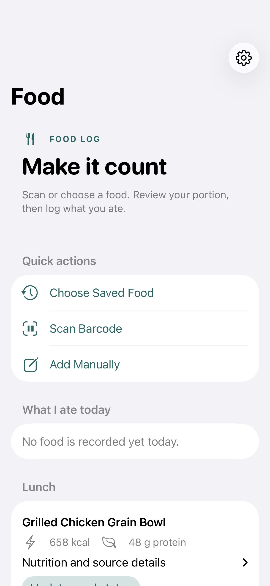
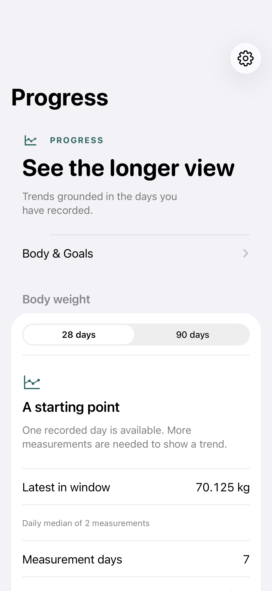
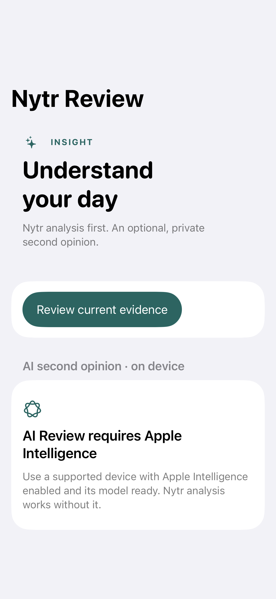

# Nytr

**An evidence-driven iOS nutrition and training companion that turns real health, food, and workout data into deterministic daily guidance.**

Nytr combines HealthKit body evidence, nutrition tracking, barcode foods, training
history, deterministic coaching, goal tracking, meal recommendations, and optional
on-device Apple Intelligence explanations while keeping factual data and
calculations authoritative.

<table>
<tr>
<td align="center"><strong>Today</strong></td>
<td align="center"><strong>Food</strong></td>
<td align="center"><strong>Progress</strong></td>
<td align="center"><strong>Review</strong></td>
</tr>
<tr>
<td></td>
<td></td>
<td></td>
<td></td>
</tr>
</table>

## What makes Nytr different

Most nutrition apps blur estimates, recommendations, and facts together, then let
a language model narrate all three. Nytr keeps them in a strict one-way pipeline:

```text
DATA
  HealthKit body mass · Hevy training history · institutional dining evidence
  Open Food Facts barcode products · owner-entered foods and measurements
      |
      v
DETERMINISTIC CALCULATION
  Typed Python domain. Exact Decimal arithmetic, trend analysis, eligibility
  gating, target proposals, progressive-overload logic. Fully unit-tested.
      |
      v
RECOMMENDATION
  Concrete, explainable output the owner can accept, edit, or reject.
  Target changes require explicit owner approval.
      |
      v
OPTIONAL AI EXPLANATION
  Prose only. Reads the numbers that were already computed. Cannot author,
  correct, or override any fact. Entirely removable.
```

The AI layer is never the source of a nutritional fact. Every number shown in the
app is produced by deterministic code that is covered by tests, and every value
carries provenance describing where it came from and how confident it is. When
evidence is missing or partial, Nytr fails closed and says so instead of
guessing — unknown values stay "unknown" and never silently become zero.

## Features

**Today**
- Daily dashboard with recorded calories and protein against approved targets
- Explicit evidence-completeness state (complete / partial / unknown values)
- Next Meal recommendations from remaining meal opportunities and remaining macros
- Lunch and Dinner meal guidance sections

**Food**
- Barcode scanning via VisionKit, resolved against Open Food Facts
- Versioned barcode normalization (`barcode-food-import.v3`) that distinguishes
  mass from volume using structured provider evidence and never infers density
- Owner-entered serving from the package label, with cross-dimension conversions
  refused rather than approximated
- Manual custom foods with per-serving nutrition
- Serving-size previews before logging
- "What I ate today" projection across every source
- Editable and voidable food log using append-only correction semantics, so
  history is superseded rather than rewritten

**Body & Goals**
- HealthKit body-mass sync with deduplication and deletion round-trips
- Calorie target setup and protein target proposals requiring owner approval
- Waist measurement tracking as supplementary evidence
- Phase assessment over goal direction and observed rate

**Progress**
- Weight-trend analysis with freshness and coverage reporting
- Nutrition-quality evidence over recorded intake

**Training**
- Hevy training history import with source-authoritative set detail
- Deterministic progressive-overload coaching
- lb/kg presentation toggle

**Platform**
- Optional on-device Apple Intelligence review (details below)
- Local meal guidance notifications
- System / Light / Dark appearance, applied live
- Fail-closed evidence model throughout

## Optional on-device Apple Intelligence review

Nytr supports an optional **Nytr Review** second opinion generated by Apple
Foundation Models running **on device**.

- Inference is local. Evidence does not leave the device for this path, and no
  OpenAI or Gemini API key is required.
- It requires a device and OS that support Apple Intelligence, with the feature
  enabled and its model downloaded. Nytr checks `SystemLanguageModel` availability
  and degrades gracefully. **Not every iPhone supports Apple Intelligence.**
- It is optional and non-authoritative. Deterministic Nytr analysis is shown
  first and remains the authority for every number.
- A provider-neutral cloud port also exists but is **disabled by default** and is
  equally non-authoritative.

## Architecture

**iOS** — Swift, SwiftUI, HealthKit, Swift Charts, VisionKit, UserNotifications,
and Foundation Models where available. Observable view models, no third-party
Swift packages.

**Backend** — Python 3.11+, FastAPI, PostgreSQL/Supabase with row-level security,
psycopg, Pydantic. A typed domain layer holds all arithmetic and is independent of
FastAPI, the database driver, and any provider SDK.

**Integrations** — HealthKit (body mass, workouts), Hevy (training detail),
institutional dining data (menu and label evidence via a bounded fail-closed
adapter), Open Food Facts (barcode products).

**AI** — on-device Apple explanation only in the current public architecture where
supported; non-authoritative in all cases.

```text
HealthKit / Hevy / dining / Open Food Facts / owner input
      -> authenticated adapters with provenance capture
      -> PostgreSQL + row-level security
      -> deterministic typed Python domain
      -> SwiftUI companion
      -> optional non-authoritative explanation
```

HealthKit is authoritative for body weight and workout observations. Hevy is
authoritative for imported exercise and set detail. Dining providers are
authoritative only for published menu and nutrition evidence. Owner-entered
profile, waist evidence, targets, goal direction, and consumption decisions stay
explicit and separate.

## Engineering practices

- Deterministic domain logic with exact `Decimal` arithmetic — no floats in
  nutrition or target math
- Strict `mypy`, `Ruff` lint and format across the backend
- ~1,000 backend tests and ~250 iOS tests, including render and appearance
  regression tests
- Versioned policies (`barcode-food-import.v3`,
  `next-meal.remaining-opportunities.v2`) so behaviour changes are explicit and
  historical records stay reproducible
- Immutable, append-only records for foods, corrections, and approved targets

## Local setup

```bash
cp .env.example .env

cd backend
python -m venv .venv
.venv/bin/pip install -e '.[dev]'
.venv/bin/pytest
.venv/bin/ruff check src tests
.venv/bin/mypy
```

No credentials are needed for the test suite. Database-backed integration tests
skip unless `STACKS_TEST_DATABASE_URL` points at a scratch Postgres, and
institutional ingestion is disabled by default.

For iOS, generate the Xcode project from
`ios/NutritionHealthCompanion/Project/project.yml` (via
[XcodeGen](https://github.com/yonaskolb/XcodeGen)) and supply local values through
`Config.xcconfig`. A non-Xcode typecheck harness is available:

```bash
ios/Harness/run_harness.sh
```

Never commit local credentials.

## Privacy and demo data

This public repository contains **synthetic fixtures and demo-safe values only**.

- No owner production health records — no real weight, waist, body measurements,
  calorie history, or consumption history
- No production credentials, database URLs, or deployment configuration
- No institutional dining pages, menus, or provider identifiers
- No real training history
- Screenshots are rendered from fabricated fixtures, not from personal data

Fixtures under `tests/fixtures/stacks/` and `backend/tests/fixtures/hevy/` are
fabricated to exercise parser and sync states. Open Food Facts attribution
obligations are described in
[THIRD_PARTY_NOTICES.md](THIRD_PARTY_NOTICES.md).

## Project status

Production-validated personal project; public repository contains a sanitized,
reproducible version of the codebase.

Further reading: [architecture notes](docs/ARCHITECTURE.md) ·
[nutrition engine](docs/NUTRITION_ENGINE.md) ·
[AI architecture](docs/LLM_ARCHITECTURE.md) ·
[Body & Goals](docs/BODY_GOALS.md) ·
[security and privacy](SECURITY.md) ·
[contributing](CONTRIBUTING.md)

## License

[MIT](LICENSE) for Nytr's own source. Third-party data and frameworks retain
their own terms — see [THIRD_PARTY_NOTICES.md](THIRD_PARTY_NOTICES.md).
